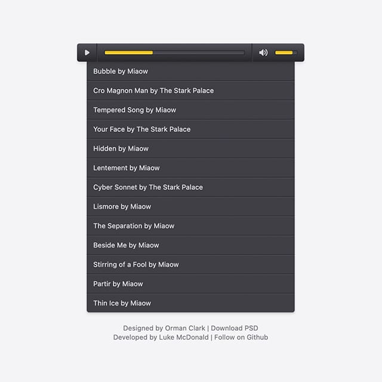

# Premium Pixels jPlayer Skin

A responsive HTML5 jPlayer skin with playlist.

__Contributors:__ [Luke McDonald](https://twitter.com/thelukemcdonald)  
__Requires:__ [jPlayer](http://jplayer.org)  
__License:__ [MIT license](http://opensource.org/licenses/MIT)  

Inspired by the Premium Pixels audio player skin designed by Orman Clark.

* [PSD](http://www.premiumpixels.com/freebies/custom-audio-player-skin-psd/)
* [Demo](http://lukemcdonald.github.io/jplayer-skin-premium-pixels/)

## Licenses

jPlayer is licensed under the MIT.  
Source: http://opensource.org/licenses/MIT

Themicons is dual-licensed under the SIL Open Font License 1.1 and GPL-2.0+FE.  
Source: https://github.com/cedaro/themicons/

Premium Pixels audio player design is licensed under it's own free license.  
Source: http://www.premiumpixels.com/licensing/
